# MessageWindowWPF
Includes MessageBox with a more modern interface and rich text support, InputBox, can auto-closing Prompt Window, Toast notification. Support to switch dark or light theme.     
包括支持富文本的更现代化界面的消息框、输入框、可自动关闭的提示窗、桌面弹出通知。支持设置浅色/深色主题。    
   
MessageBox:     
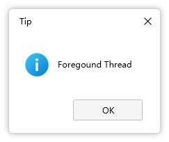      
    
InputBox:     
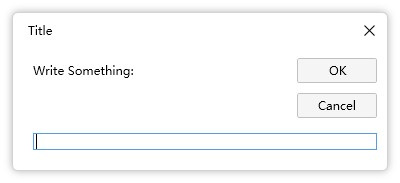     
    
Prompt:     
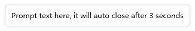     

Toast notification:     
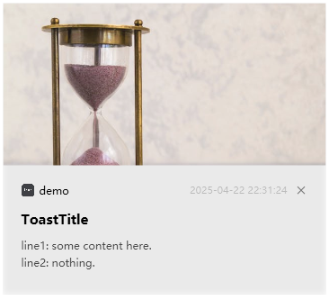   

DarkTheme:      
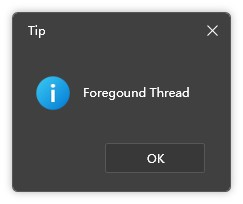
     
[](https://github.com/tp1415926535/MessageWindowWPF/releases) 
[](https://www.nuget.org/packages/MessageWindowWPF) 
[](https://github.com/tp1415926535/MessageWindowWPF/blob/master/LICENSE) 
        

[](https://github.com/tp1415926535/MessageWindowWPF#english-description) 
[](https://github.com/tp1415926535/MessageWindowWPF#中文说明)      
       
       
# English Description
Download package from Nuget, or using the release Dll.   
  
## MessageBox 
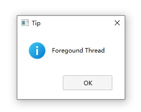       
      
Except for the absence of the MessageBoxOptions parameter, all other features are seamlessly integrated with the original version.   

Set global using to replace all Messagebox:
```c#
global using MessageBox = MessageWindowWPF.MessageBox;
```
Or just replace in one script:
```c#
using MessageBox = MessageWindowWPF.MessageBox; //Just add the namespace

  MessageBox.Show("Message!");
  MessageBox.Show("Message2!", "Tip", MessageBoxButton.OK, MessageBoxImage.Information);
```

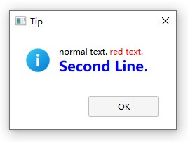     
If you want to display rich text, you can also just pass in the parameters:
```c#
using MessageBox = MessageWindowWPF.MessageBox; 

  List<Inline> inlines = new List<Inline>();
  inlines.Add(new Run("normal text. "));
  inlines.Add(new Run("red text.") { Foreground = Brushes.Red });
  MessageBox.Show(inlines, "Tip", MessageBoxButton.OK, MessageBoxImage.Information);
```

If you want to customize the button text:
```c#
using MessageBox = MessageWindowWPF.MessageBox; 

  MessageBox.Show(new MessageBoxParams() { Text ="Text", Title = "Title", CustomOkText = "Confirm" });
```

Some configurations can also be customized:
```c#
using MessageWindowWPF;
using MessageBox = MessageWindowWPF.MessageBox;

  MessageSetting.NoSystemHeader = MessageSetting.WithCornerRadius = true; //Without system title bar, and change to rounded corners
  MessageSetting.UseDarkTheme = true;//set dark or light theme. Default is light theme.
  //MessageSetting.CustomColor = new MessageSetting.CustomColorData() { WindowText = Colors.Red };//even control text, background and other color
  MessageBox.Show("Message!", "Tip", MessageBoxButton.OK, MessageBoxImage.Information);
```

## InputBox
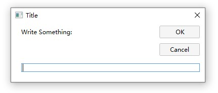      

Input box similar to VB's component.
```c#
using MessageWindowWPF;

  InputBox inputBox = new InputBox();
  if (inputBox.ShowDialog("Write Something:", "Title") == true)
    Console.WriteLine(inputBox.value);
```
Function:     
`bool? result = inputBox.ShowDialog(string message = null, string title = null, string defaultValue = null)`   

Allow setting `MaxLength`. And `PasswordChar` can turn the input box into a password box.
```c#
InputBox inputBox = new InputBox();
inputBox.MaxLength = 5;
inputBox.PasswordChar = '●';
```

Some configurations can also be customized:
```c#
using MessageWindowWPF;

  MessageSetting.NoSystemHeader = MessageSetting.WithCornerRadius = true;
  MessageSetting.UseDarkTheme = true;
  //MessageSetting.CustomColor = new MessageSetting.CustomColorData() { WindowText = Colors.Red };
  InputBox inputBox = new InputBox();
  if (inputBox.ShowDialog("Write Something:", "Title") == true)
    Console.WriteLine(inputBox.value);
```

## Prompt
      

Fade-in and fade-out cues, support countdown and double click to close.
```c#
using MessageWindowWPF;

  Prompt.Show("Show text");
```
Function:    
`Prompt p = Prompt.Show(string content, double liveSeconds = 3, Window owner = null, Point? point = null, Color? backColor = null)`   
When the parameter value of "liveSeconds" <= 0, the window will be displayed until it is closed by double-clicking.    
     
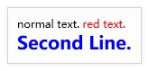     
If you want to display rich text, you can also just pass in the parameters:
```c#
using MessageWindowWPF;

  List<Inline> inlines = new List<Inline>();
  inlines.Add(new Run("normal text. "));
  inlines.Add(new Run("red text.") { Foreground = Brushes.Red });
  Prompt.Show(inlines);
```

You can also set click events to display clickable text and arrows on the right side.
```c#
Prompt.Show(new PromptParams()
{
    Content = "Prompt text here, it will auto close after 3 seconds",
    ActionText = "Click Here",
    Action = (() =>
    {
        MessageBox.Show("ClickPrompt Event");
    }),
    ActionForeColor = Colors.Orange
});
```


Custom configurations only have an effect on the color, but the color parameter of the function has a higher priority:
```c#
using MessageWindowWPF;
  MessageSetting.UseDarkTheme = true;
  MessageSetting.CustomColor = new MessageSetting.CustomColorData() { WindowText = Colors.Red };
  Prompt.Show("Show text");
```

## Toast notification
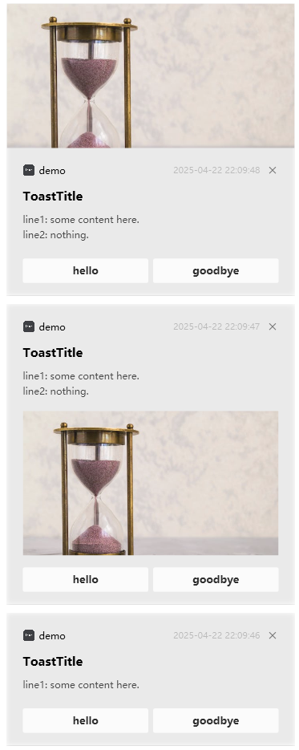   
Notification in the bottom right corner of the desktop, imitating the default notification of the Windows system.
*(Due to Microsoft's official UWP package forcing the specification of Windows version and causing issues with publishing a single exe, I implemented this notification on my own)*

```c#
using MessageWindowWPF;

new ToastWindowBuilder()
    .SetTitle("Application name")
    .SetIcon(new Uri("/Resources/logo.png", UriKind.RelativeOrAbsolute))
    .SetHeader("Notification prompt title")
    .AddContent("Notification Details")
    .Show();
```
The `ToastWindowBuilder` support following setting：
- `SetTime(string time)`：create time string
- `SetIcon(Uri uri)`：application icon
- `SetTitle(string text)`：application name
- `SetLargeIcon(Uri uri, bool isCircle = false)`：large icon
- `SetHeader(string text)`：Notification title
- `AddContent(string text)`：Notification Details, each item represents a line
- `SetHeadImage(Uri uri)`：image which displayed above the title
- `SetBodyImage(Uri uri)`：image which displayed below the content and above the button.
- `AddButton(string text, Action action)`：Button text and corresponding events, each button is evenly distributed in width
- `SetAudioPath(string file)`：Customize the path for playing sound effects
- `SetDuration(int seconds)`：Notification duration, default is 7 seconds. If it is less than or equal to 0, it will always be displayed until manually turned off
- `KeepDisplay()`：Always be displayed until manually turned off
- `Mute()`：Notify whether to mute
- `Show()`：show the toast

You can also customize some configurations：
```csharp
//dark theme
MessageSetting.UseDarkTheme = true;

//The maximum number of notifications displayed simultaneously exceeds the queue waiting time. If it is less than or equal to 0, there is no limit
MessageSetting.ToastMaxCount = 3;

//Latest notification display at the bottom, contrary to the default behavior of the Windows system
MessageSetting.ToastLatestAtBottom = true;

//Allow double clicking notifications to close
MessageSetting.ToastDoubleClickClose = true;
```


## Additional information
* Because there are only four buttons, the current text only comes with Chinese and English. 
The default is displayed in the current language. Alternatively, you can set it manually by changing the value of **"MessageSetting.settings.UIculture"**. 

## Version   
* v2.2.0 2025/07/18 MessageBox allows passing dto as param, and be able to customize the button display text. Prompt allows passing dto as param, you can set customized click action. InputBox can set the maximum length, and set the password char can become a password input box
* v2.1.0 2025/04/23 Add ToastWindowBuilder class to simplify generation, Toast adds support for large icons
* v2.0.0 2025/04/22 Added a notification in the bottom right corner of the desktop imitating the Windows system. Style code optimization, unification, and adjustment.
* v1.2.0 2025/03/21 Fix a static variable that causes a problem with the result of closing the window directly.
* v1.1.0 2022/11/06 added support for light and dark themes, simplified settings, and allowed for full customization of colors.
* v1.0.0 2022/12/07 Basic features. 
---
   
# 中文说明   

从Nuget下载包，或者引用release的Dll。   
  
## 消息窗（MessageBox）
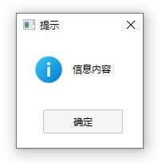      
除了没有 MessageBoxOptions 参数之外，其他功能都与原版无缝衔接。     
设置全局引用来替换所有的弹窗:
```c#
global using MessageBox = MessageWindowWPF.MessageBox;
```
或者只替换其中一个脚本:
```c#
using MessageBox = MessageWindowWPF.MessageBox; //添加这行即可

  MessageBox.Show("消息！");
  MessageBox.Show("消息2！", "提示", MessageBoxButton.OK, MessageBoxImage.Information);
```
  
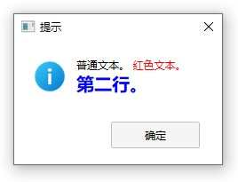     
如果想要显示富文本，也只需传入参数即可:
```c#
using MessageBox = MessageWindowWPF.MessageBox; 

  List<Inline> inlines = new List<Inline>();
  inlines.Add(new Run("普通文本。 "));
  inlines.Add(new Run("红色文本。") { Foreground = Brushes.Red });
  MessageBox.Show(inlines, "提示", MessageBoxButton.OK, MessageBoxImage.Information);
```

如果你希望自定义按钮文本:
```c#
using MessageBox = MessageWindowWPF.MessageBox; 

  MessageBox.Show(new MessageBoxParams() { Text ="内容", Title = "标题", CustomOkText = "我已了解" });
```

还可以自定义一些配置：
```c#
using MessageWindowWPF;
using MessageBox = MessageWindowWPF.MessageBox;

  MessageSetting.NoSystemHeader = MessageSetting.WithCornerRadius = true;//不使用系统标题栏，以及变为圆角
  MessageSetting.UseDarkTheme = true;//设置明暗主题。默认是亮主题
  //MessageSetting.CustomColor = new MessageSetting.CustomColorData() { WindowText = Colors.Red };//甚至完全自定义文本和背景等颜色
  MessageBox.Show("消息!", "提示", MessageBoxButton.OK, MessageBoxImage.Information);
```

## 输入框（InputBox）
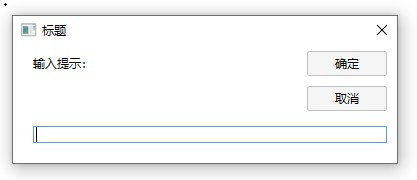      
类似于VB组件的输入框
```c#
using MessageWindowWPF;

  InputBox inputBox = new InputBox();
  if (inputBox.ShowDialog("输入提示：", "标题") == true)
    Console.WriteLine(inputBox.value);
```
函数:   
`bool? result = inputBox.ShowDialog(string message = null, string title = null, string defaultValue = null)`   

允许设置最大长度`MaxLength`. 并且 `PasswordChar` 可以使输入框变为密码框。
```c#
InputBox inputBox = new InputBox();
inputBox.MaxLength = 5;
inputBox.PasswordChar = '●';
```

还可以自定义一些配置：
```c#
using MessageWindowWPF;

  MessageSetting.NoSystemHeader = MessageSetting.WithCornerRadius = true;
  MessageSetting.UseDarkTheme = true;
  InputBox inputBox = new InputBox();
  if (inputBox.ShowDialog("输入提示：", "标题") == true)
    Console.WriteLine(inputBox.value);
```

## 提示（Prompt）
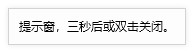      
淡入和淡出的提示，支持倒计时和双击关闭。
```c#
using MessageWindowWPF;

  Prompt.Show("提示文字");
```
函数：     
`Prompt p = Prompt.Show(string content, double liveSeconds = 3, Window owner = null, Point? point = null, Color? backColor = null)`   

当"liveSeconds" 的参数值<=0时，窗口将会一直显示直到双击关闭它。      
   
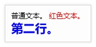     
如果想要显示富文本，也只需传入参数即可:
```c#
using MessageWindowWPF;

  List<Inline> inlines = new List<Inline>();
  inlines.Add(new Run("普通文本。 "));
  inlines.Add(new Run("红色文本。") { Foreground = Brushes.Red });
  Prompt.Show(inlines);
```

还可以设置点击事件，使得右侧出现可以点击的文字和箭头
```c#
Prompt.Show(new PromptParams()
{
    Content = "Prompt text here, it will auto close after 3 seconds",
    ActionText = "Click Here",
    Action = (() =>
    {
        MessageBox.Show("ClickPrompt Event");
    }),
    ActionForeColor = Colors.Orange
});
```

自定义配置只有颜色有作用，但是调用函数的颜色参数优先级更高:
```c#
using MessageWindowWPF;
  MessageSetting.UseDarkTheme = true;
  //MessageSetting.CustomColor = new MessageSetting.CustomColorData() { WindowText = Colors.Red };
  Prompt.Show("提示文字");
```

## 弹出通知（Toast）
   
桌面右下角通知，仿win系统默认通知。   
*（鉴于微软官方的uwp包强制指定windows版本，并且导致发布单个exe有问题，才自行实现了这个通知）*
```c#
using MessageWindowWPF;

new ToastWindowBuilder()
    .SetTitle("应用名称")
    .SetIcon(new Uri("/Resources/logo.png", UriKind.RelativeOrAbsolute))
    .SetHeader("通知提示标题")
    .AddContent("通知详情")
    .Show();
```
其中`ToastWindowBuilder`支持如下设置：
- `SetTime(string time)`：时间文本
- `SetIcon(Uri uri)`：应用图标
- `SetTitle(string text)`：应用名称
- `SetLargeIcon(Uri uri, bool isCircle = false)`：大图标
- `SetHeader(string text)`：通知标题
- `AddContent(string text)`：通知内容，每项代表一行
- `SetHeadImage(Uri uri)`：头图，显示在标题上方
- `SetBodyImage(Uri uri)`：插图，显示在内容下方，按钮上方。
- `AddButton(string text, Action action)`：按钮文本和对应事件，所有按钮都在同一行并宽度均等分布
- `SetAudioPath(string file)`：自定义播放音效的路径
- `SetDuration(int seconds)`：通知停留时长，默认7秒，小于等于0则始终显示直到手动关闭
- `KeepDisplay()`：是否始终显示
- `Mute()`：通知是否静音
- `Show()`：显示toast

还可以自定义一些配置：
```csharp
//深色主题
MessageSetting.UseDarkTheme = true;

//最大同时显示通知数量，超出排队等候。小于等于0则无限制
MessageSetting.ToastMaxCount = 3;

//最新通知是否显示最底下，与win系统默认行为相反
MessageSetting.ToastLatestAtBottom = true;

//是否允许双击通知关闭
MessageSetting.ToastDoubleClickClose = true;
```


## 其他说明
* 因为只有四个按钮，所以目前的文字只带有中文和英文。
默认按当前语言显示，另外还可以通过改变 **MessageSetting.settings.UIculture** 的值来手动设置它。

## Version   
* v2.2.0 2025/07/18 MessageBox允许传入dto作为参数，可以自定义按钮显示文本；Prompt允许传入dto作为参数，可以设置自定义点击事件；InputBox可以设置最大长度，设置密码符号可以变为密码输入框
* v2.1.0 2025/04/23 增加ToastWindowBuilder辅助类简化生成，Toast增加大图标支持。
* v2.0.0 2025/04/22 增加仿win系统的桌面右下角的通知。样式代码优化统一和调整。
* v1.2.0 2025/03/21 修复静态变量导致直接关闭窗口结果有问题。
* v1.1.0 2022/11/06 增加明暗主题支持，简化设置，允许完全自定义颜色。
* v1.0.0 2022/12/07 基本功能。
